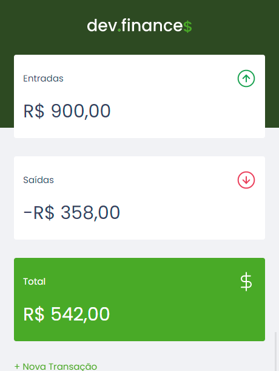
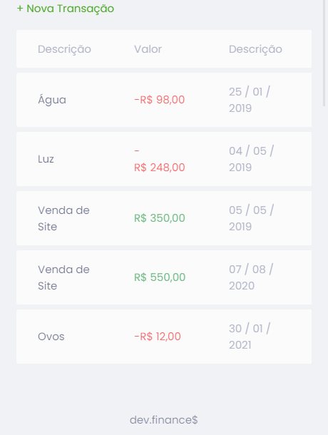
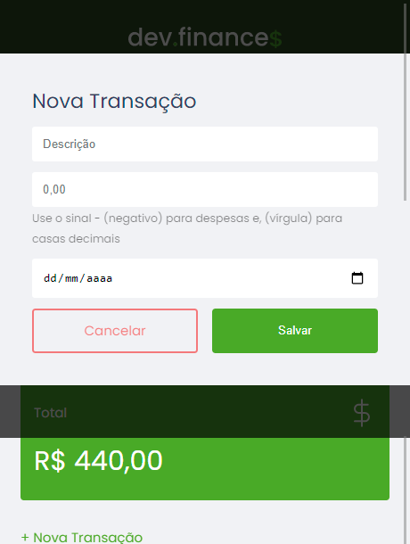
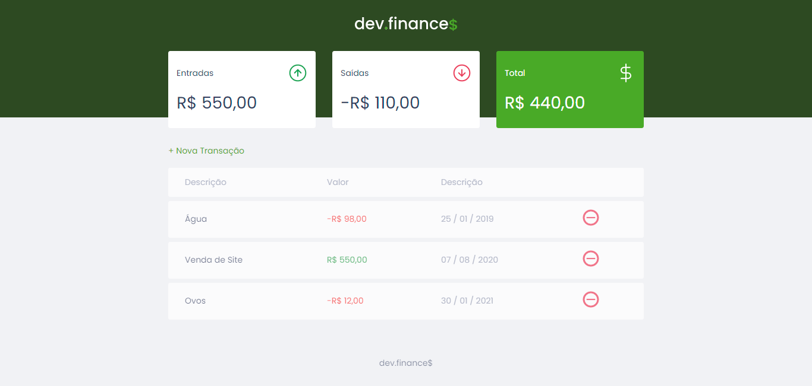
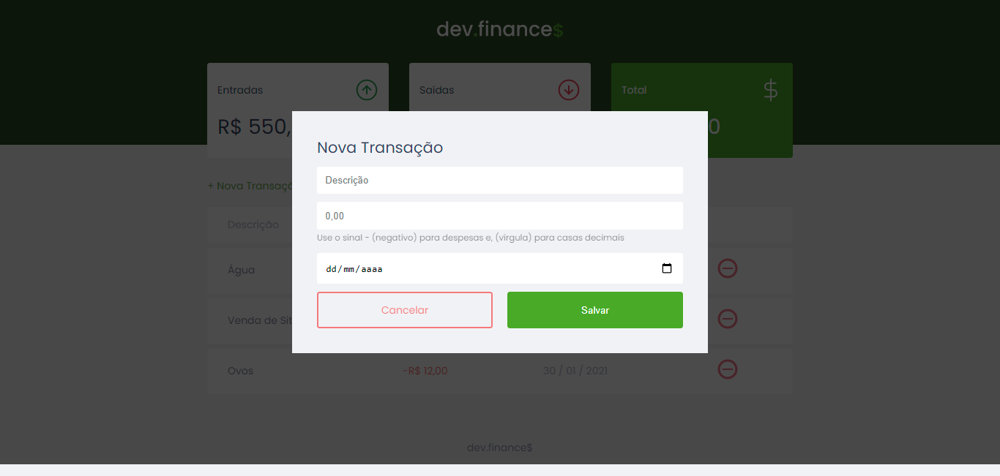

<h1 align="center">
    
</h1>

<p align ="center">
  <a href='https://duarterenan.github.io/dev.finances/#'> View Demo</a>
</p>

## 💻 About

The ***dev.finance$*** its a web application in then you can add or remove your money gains and loss, with the description and date of theys.

This project was developed following the videos of ***Maratona Discover***, offered by [Rocketseat](https://blog.rocketseat.com.br/primeira-next-level-week/) and ministered by [Mayk Brito](https://github.com/maykbrito).

## ⚙️ Features

- [x] Users can add or remove incomes and expenses with description and date.
- [x] Show the final total values add:
    * Total incomes added.
    * Total expenses added.
    * Sum of all values added.
- [x] Show the total incomes added.
- [x] Show the total of all values added.
- [ ] User can change the order of finances by: date/value.
- [ ] Automatic toggle to user default mode (dark/light).

## 🎨 Layout:

### Mobile
<p align = center>
  
  
  
<p>

### Web

<p align = center>
  
  
<p>

## Getting Started

For use this, you just need a browser like a Google Chrome (recommended). The alterations will getting saved by user browser local storage.

### Installation

1. Clone the repo
   ```sh
   git clone https://github.com/DuarteRenan/dev.finances.git
   ```
 2. Double click on the index.html file.

## 🦸 Author
 [](https://www.linkedin.com/in/renan-duarte-166402141/)
  
## 🛠 Language and Tools:
 <a href="https://www.photoshop.com/en" rel="nofollow">  </a>
   <a href="https://www.w3.org/html/" rel="nofollow">  </a>
   <a href="https://developer.mozilla.org/en-US/docs/Web/JavaScript" rel="nofollow">  </a>
   <a href="https://www.w3schools.com/css/" rel="nofollow">  </a>
   
## 📝 License

This project is under the license [MIT](./LICENSE).

